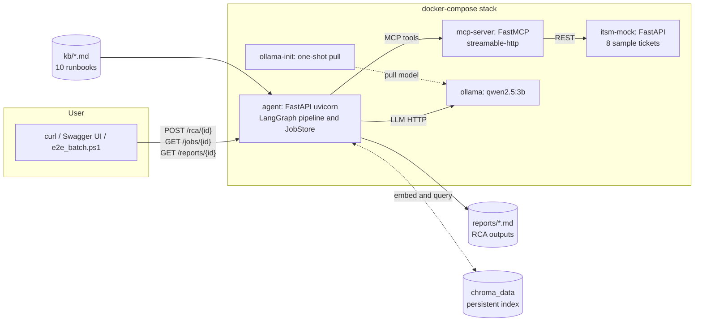
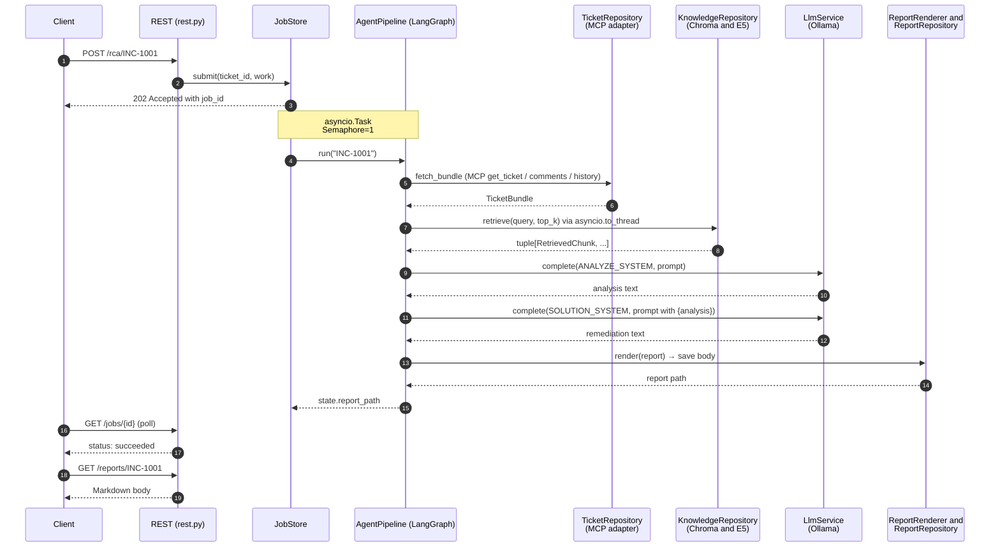

# Architecture

This is a local ITSM Root-Cause-Analysis agent. It pulls tickets from a mock ITSM using an MCP server, gets context from a 10-document knowledge base with RAG, and uses an offline LLM to create a Markdown RCA report for each ticket. The codebase uses DDD and n-tier structure with Hexagonal port-adapter boundaries.

## High-level topology


<details>
<summary>Source (mermaid)</summary>



</details>

## Per-ticket RCA flow


<details>
<summary>Source (mermaid)</summary>



</details>

## Code layout: DDD / n-tier

```
agent/src/itsm_agent/
├── domain/         # pure model, 5 ports, and 1 service (no framework)
├── application/    # DTO, use cases, LangGraph pipeline, formatting, and prompts
├── infrastructure/ # 4 port adapters (llm, rag, mcp, reports)
├── composition/    # AgentConfig, AgentBuilder, and AgentApplication façade
└── interfaces/     # CLI, REST (FastAPI), and JobStore
```

**Dependency direction:** domain is at the core, then application, then (infrastructure / composition / interfaces). Each outer ring depends on the layer inside it, never the other way around. Composition is framework-agnostic. Infrastructure imports are done lazily inside `with_default_*` builder methods. Interfaces only translate and do not contain business logic.

### `domain/`

This is a pure model. It uses `@dataclass(frozen=True, slots=True)` for immutability, tuples for collections, and `runtime_checkable` Protocols for ports.

| Public symbol | Kind | Purpose |
|---|---|---|
| `Ticket`, `TicketBundle`, `RcaReport` | Aggregate / Entity | Core domain types |
| `Comment`, `HistoryEvent`, `Priority` | Value object / Enum | Evidence and classification |
| `TicketId`, `RetrievedChunk`, `KbReference` | Value object | Typed identity and RAG result types |
| `TicketRepository` | Port (async) | `fetch_bundle`, `list_open_ticket_ids` |
| `LlmService` | Port (async) | `complete(system, user)`, `model_name` |
| `KnowledgeRepository` | Port (sync) | `retrieve(query, top_k)` |
| `ReportRenderer` | Port (sync) | `render(report) → str` |
| `ReportRepository` | Port (sync) | `save(report, body) → path` |
| `RetrievalQueryBuilder` | Service | `build(ticket, comments) → query` |

The async and sync split is intentional. I/O ports like HTTP are async, while CPU or local ports such as Chroma, rendering, and filesystem are sync. The pipeline uses `asyncio.to_thread` to cross between them.

### `application/`

This layer handles orchestration only. It includes five files:

- **`dto.py`**: Contains `RcaRequest` and `RcaResponse(ticket_id, report_path, error)`. It uses a result-as-data pattern, so there are no exceptions to serialize over the REST or job boundary.
- **`use_cases.py`**: Includes `GenerateRcaUseCase` and `BatchGenerateRcaUseCase`. These are thin coordinators over the pipeline.
- **`pipeline.py`**: `AgentPipeline` is a 5-node LangGraph DAG. Each node delegates to a domain port. The pipeline handles only orchestration and short-circuit-on-error logic.
- **`formatting.py`**: Provides comment, history, and KB-chunk Markdown formatters. These are shared between LLM prompts and the rendered report to keep them in sync.
- **`prompts.py`**: Contains `ANALYZE_SYSTEM` / `HUMAN` and `SOLUTION_SYSTEM` / `HUMAN` templates. System prompts include anti-hallucination guards, enforce phase separation with instructions like "Do NOT include solution steps in this section," and require citations by runbook source filenames in parentheses.

**Pipeline = case requirements (1 : 1):**

| Node | Port | Case requirement |
|---|---|---|
| `_node_fetch` | `TicketRepository` | 1. ITSM via MCP |
| `_node_retrieve` | `KnowledgeRepository` (via `asyncio.to_thread`) | 4. RAG over KB |
| `_node_analyze` | `LlmService` (ANALYZE prompt) | 2. offline LLM analysis |
| `_node_propose` | `LlmService` (SOLUTION prompt, chained on `{analysis}`) | 3. solution proposal |
| `_node_write_report` | `ReportRenderer` and `ReportRepository` | 5. per-ticket RCA |

Each node uses `try/except`, logs exceptions, and sets `state["error"]` to short-circuit. This way, any failure is captured as a result instead of being thrown across the async-job boundary.

### `infrastructure/`

There are four sub-packages, each behind a single port:

- **`mcp/McpTicketRepository`**: This is a `TicketRepository` over MCP streamable-HTTP. It is stateless, with a new session for each call. Each bundle makes three tool calls (`get_ticket`, `get_ticket_comments`, `get_ticket_history`). The `_decode` method has a three-way fallback for different MCP response shapes: `structuredContent`, single-key unwrap, or `content[0].text` JSON parse.
- **`llm/OllamaLlmService`**: This is an `LlmService` over `langchain_ollama.ChatOllama`. It exposes `model_name` so the renderer footer can attribute the analysis. The `temperature` and `num_ctx` settings come from `OllamaConfig`, with no constructor defaults to keep a single source of truth.
- **`rag/`**: Contains three composable classes (the inner hexagon):
  - `MarkdownChunker`: H2-based section splitter; H1 fallback to "Overview".
  - `E5Embedder`: encapsulates the E5 prefix convention (`"query: "` / `"passage: "`) and `normalize_embeddings=True`.
  - `ChromaKnowledgeRepository`: persistent client with fingerprint-based incremental indexing (SHA-256 of name, size, mtime per `*.md`). Cosine score reconstructed from L2 distance on normalized vectors (`1.0 - dist/2.0`).
- **`reports/`**: Includes `MarkdownReportRenderer`, which renders all sections and adds a footer naming the LLM model, RAG chunk count, and MCP source. `FilesystemReportRepository` writes the report to `{out_dir}/{ticket_id}.md`.

### `composition/`: composition root

`AgentConfig` is the only place where environment variables are read. There are five frozen dataclasses (`OllamaConfig`, `RagConfig`, `McpConfig`, `ReportsConfig`, `AgentConfig`) and a `from_env()` method. The `_int_env` and `_float_env` helpers raise descriptive `ValueError`s for malformed inputs.

`AgentBuilder` is a fluent wiring object with two symmetric API surfaces:

- **`with_default_*`**: These are environment-driven adapters. Imports from `itsm_agent.infrastructure.*` happen inside these methods, so the composition module stays framework-agnostic.
- **`with_custom_*`**: Accepts any object that conforms to the Protocol. This is used for tests and alternative wirings.

`build()` collects collaborators, checks for `None` values, constructs `PipelineDependencies`, and returns an `AgentApplication` façade. The façade only exposes `run_for_ticket`, `run_all`, and `list_open_ticket_ids`. External code never interacts directly with a pipeline, renderer, or framework object.

`build_default_application(config: AgentConfig | None = None)` is a convenience method that runs the full default chain.

### `interfaces/`

There are three entrypoints, each designed to be simple.

- **`cli.py`**: Uses `argparse`, accepts a single ticket id as a positional argument or `--all`. It translates argv to use case calls and exit codes (`stdout` for success, `stderr` for failure). It reads environment variables once.
- **`jobs.py`**: `JobStore` is an in-memory async job registry. The `JobStatus` state machine goes from `QUEUED` to `RUNNING` to either `SUCCEEDED` or `FAILED`. A `_lock` guards the registry dictionary, and `_semaphore=1` serializes execution because Ollama serializes requests. Running eight parallel POSTs would only cause thrashing. The registry is bounded with FIFO eviction (`max_records=500`). A defensive `try/except` in `_run` catches anything the pipeline missed.
- **`rest.py`**: This is the FastAPI surface. The lifespan factory accepts an injected application, so tests can bypass Ollama and Chroma loading. Pydantic models are REST-specific, and the application DTO is separate. There is a three-layer translation: Pydantic to DTO to domain.

| Endpoint | Method | Purpose |
|---|---|---|
| `/health` | GET | Liveness; always returns `{"status":"ok"}` |
| `/ready` | GET | Readiness; async probes Ollama and MCP via `httpx`, 5 s timeout |
| `/tickets` | GET | List open ticket ids |
| `/rca/{ticket_id}` | POST | Enqueue a job, returns `202 Accepted` with `job_id` |
| `/jobs/{job_id}` | GET | Poll job status |
| `/reports/{ticket_id}` | GET | Fetch the rendered Markdown |
| `/docs` | GET | Swagger UI (auto) |

`/reports/{ticket_id}` validates the path parameter against `^[A-Za-z0-9][A-Za-z0-9_-]{0,63}$` and checks that `path.resolve().is_relative_to(out_dir)` before reading from disk. This provides defense in depth against path traversal.

## Cross-cutting concerns

| Concern | How it is handled |
|---|---|
| Error handling | Every pipeline node has `try/except`, `log.exception`, and `state["error"]`. Domain-specific errors (`LookupError` for missing tickets) are caught at `_node_fetch`. `JobStore._run` provides a final-line defensive catch. |
| Logging | `logging.getLogger(__name__)` everywhere; pipeline lines tagged `[%s]` with the ticket id. `print` is reserved for CLI human output. |
| Configuration | `AgentConfig.from_env()` is the only place env is read. Helpers raise descriptive errors for bad input. Magic constants (chroma collection name, dependency probe names) live in config / `Literal` types. |
| Async / sync | I/O ports async, CPU ports sync. The async pipeline crosses sync ports with `asyncio.to_thread` to keep the event loop responsive. |
| Type discipline | `frozen=True, slots=True` dataclasses; `tuple[..., ...]` collections; `runtime_checkable` Protocols; `Literal` for closed enumerations. No `# type: ignore` left in the source tree. |
| Layer discipline | Application does not import infrastructure. Composition imports infrastructure lazily. Domain imports nothing framework-specific. |
| Security | Path traversal hardened on `/reports/{ticket_id}`. KB volume mounted read-only. Outbound LLM, MCP, and HTTP requests have explicit timeouts. |

## Runtime topology: Docker Compose

Five services, three named volumes:

| Service | Image | Healthcheck | Notes |
|---|---|---|---|
| `ollama` | `ollama/ollama:latest` | `ollama list` | LLM runtime |
| `ollama-init` | `ollama/ollama:latest` | n/a, exits | One-shot model pull, `service_completed_successfully` gate |
| `itsm-mock` | local build | dependency-free Python `urllib` | 8 sample tickets, FastAPI |
| `mcp-server` | local build | port-listening Python check (MCP returns 405/406 to bare GET) | 4 MCP tools |
| `agent` | local build | `curl /health`, `start_period=90s` | uvicorn long-running, REST surface |

| Volume | Purpose |
|---|---|
| `ollama_data` | Model weights; survives `docker compose down` (without `-v`) |
| `chroma_data` | KB index, fingerprinted; only re-built when `kb/*.md` actually changes |
| `hf_cache` | sentence-transformers cache; keeps cold-start fast on subsequent runs |

## Test layout

34 tests, ~7 s, no Ollama, Chroma, or MCP needed. Fakes implement the same Protocols as the real adapters and live in `tests/conftest.py`.

| File | Tests | Scope |
|---|---|---|
| `test_builder.py` | 3 | Config and collaborator validation |
| `test_markdown_chunker.py` | 4 | H2 split and edge cases |
| `test_markdown_renderer.py` | 4 | Header, KB references, footer, placeholder |
| `test_pipeline_with_fakes.py` | 3 | Pipeline contract: happy path, short-circuit, query content |
| `test_use_cases.py` | 4 | `generate_one`, `generate_all`, two-LLM-call assertion |
| `test_rest_api.py` | 16 | Endpoint smoke, path-traversal (7-case parametric), `/ready` (happy and degraded, monkeypatched) |

Architectural decisions are pinned by tests: the two-LLM-call flow is asserted (`fake_llm.calls == 2`); the query content strategy is asserted (`"DB lock contention"`, `"deadlock detected"`, `"spike at 08:02"` all appear in the retrieval query); the renderer footer is asserted (`"qwen2.5:3b" in body`, `"RAG over 2 runbook chunks"`).

## Case requirements: coverage

| # | Requirement | Implementation | Evidence |
|---|---|---|---|
| 1 | Pull ITSM data via MCP | `McpTicketRepository` and `mcp_server/ITSMToolset` (4 tools) | streamable-HTTP transport, `_decode` defensive fallback, `LookupError` semantics |
| 2 | Offline LLM analysis | `OllamaLlmService` (qwen2.5:3b) and `ANALYZE_*` prompts | Anti-hallucination guards in system prompt, `temperature=0.2` |
| 3 | Solution proposal | `SOLUTION_*` prompt phase, chained on `{analysis}` placeholder | Citation enforcement (`(kb_xx.md)`); two-call flow pinned by test |
| 4 | RAG over 10 KB documents | `ChromaKnowledgeRepository`, E5 multilingual, and `MarkdownChunker` | Fingerprint indexing; cosine via L2 / normalize; query-content test |
| 5 | Per-ticket RCA report | `MarkdownReportRenderer` and `FilesystemReportRepository` | Footer attributes Ollama, RAG, and MCP; 8/8 batch verified end-to-end |
